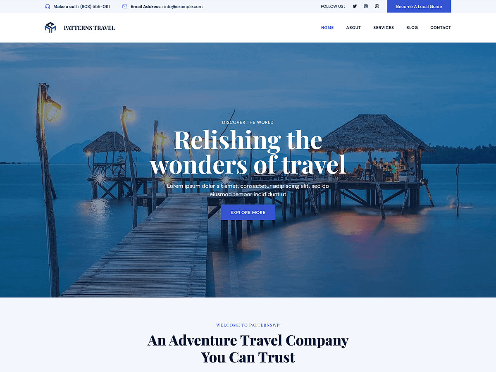

# Patterns Travel

Patterns Travel is an adventurous and versatile WordPress theme designed for travel agencies, tour operators, travel bloggers, and adventure enthusiasts. Built with WordPress Full Site Editing (FSE), this theme enables seamless customization of headers, footers, templates, and global styles directly within the WordPress Site Editor. The theme includes pre-designed patterns and layouts tailored for showcasing featured sections, about sections, travel packages, destinations, categories, customer testimonials, blogs, about, contact and services pages. Its responsive design ensures your website looks captivating and professional across all devices, offering an inspiring platform to highlight your travel services and adventures.

Primary color: `#3554d1`.



## Features

- 3 hero and landing patterns
- 7 card layouts (card-1 through card-7)
- 5 archive/post-listing patterns
- Contact page pattern (page-contact)
- 1 menu navigation pattern
- Destination page pattern
- 13 section layout patterns (featured sections and section titles)
- Full Site Editing (FSE) support
- Responsive design
- 67 block patterns + 15 templates + 11 template parts
- Travel and tourism oriented layouts (destinations, tours, gallery)

## Requirements

- WordPress 6.6 or higher
- PHP 7.0 or higher
- Tested up to WordPress 6.7

## Development

This theme uses `@wordpress/scripts`:

```sh
npm install
npm run start    # dev mode with watch
npm run build    # production build
```

## License

GNU General Public License v2 or later.

This theme is based on [WP Block Theme Boilerplate](https://github.com/codersantosh/wp-block-theme-boilerplate), (C) 2025 Santosh Kunwar, [GPLv2 or later](https://www.gnu.org/licenses/gpl-2.0.html).
